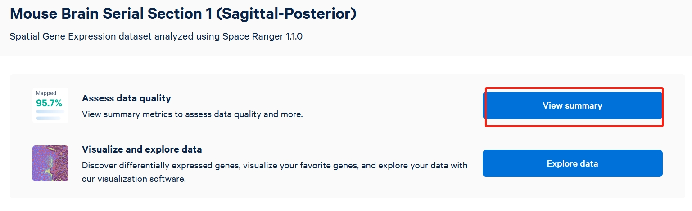
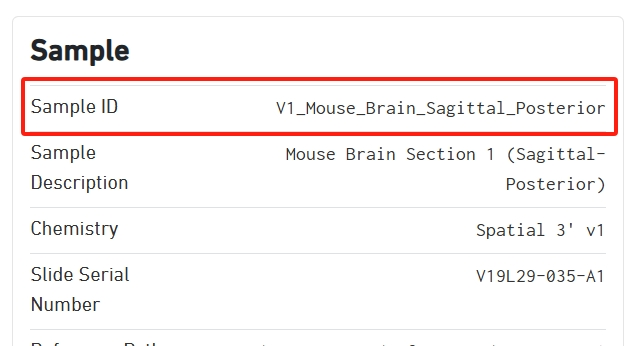
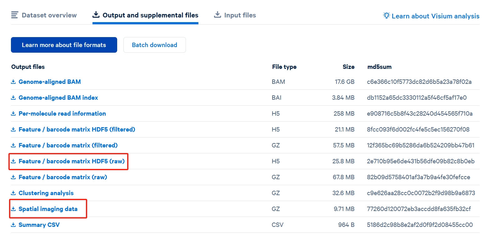
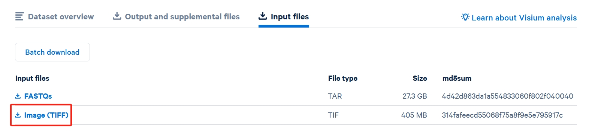

# How to download and prepare data

This tutorial will guide you on how to download and prepare the data for use with `SpaHDmap`.

There are two primary methods to load the data: 1. loading data using scanpy and 2. loading data from file paths.

## Method 1: Loading data using scanpy (recommended)

The easiest way to get started is by using the `scanpy` library to directly download and load the data as an `Anndata` object from 10X Genomics. This method will automatically download into the folder `data/` in your current working directory, and by setting `include_hires_tiff=True`, it will also download the high-resolution image associated with the dataset.

```python
import scanpy as sc
import SpaHDmap as hdmap

# Specify the 10x Genomics dataset ID
section_id = 'V1_Mouse_Brain_Sagittal_Posterior'

# Download the data using scanpy. By setting `include_hires_tiff=True`, it will also download the high-resolution image.
# The data will be saved to a local cache directory (e.g., './data/V1_Mouse_Brain_Sagittal_Posterior/')
adata = sc.datasets.visium_sge(section_id, include_hires_tiff=True)

# The path to the high-resolution image is stored in the AnnData object
image_path = adata.uns["spatial"][section_id]["metadata"]["source_image_path"]

# Now, you can use SpaHDmap's preparation function
st_data = hdmap.prepare_stdata(adata=adata,
                               section_name='mouse_posterior',
                               image_path=image_path)
```
The section id can be found in the summary of the dataset on the 10X Genomics website.





## Method 2: Loading data from file paths

Alternatively, you can manually download the necessary files from the [10X Genomics website](https://www.10xgenomics.com/resources/datasets) or use your own data source, just provide the necessary file paths to the `prepare_stdata` function in `SpaHDmap`.

There are three required files for each dataset:

1.  **Spatial coordinate data**: `tissue_positions_list.csv`
2.  **Feature / barcode matrix**: `filtered_feature_bc_matrix.h5`
3.  **Image (TIFF)**: The high-resolution tissue image file.

Here shows which data should be downloaded from 10X Genomic website.




Once downloaded, you can organize them into a directory and use the following code:

```python
import SpaHDmap as hdmap

# Define the paths to your downloaded files
data_dir = './data/V1_Mouse_Brain_Sagittal_Posterior/'
image_path = f'{data_dir}image.tif'
spot_coord_path = f'{data_dir}spatial/tissue_positions_list.csv'
spot_exp_path = f'{data_dir}filtered_feature_bc_matrix.h5'

# Load the data using file paths
# Note: You must provide the spot radius in pixels for this method.
st_data = hdmap.prepare_stdata(section_name='mouse_posterior',
                               image_path=image_path,
                               spot_coord_path=spot_coord_path,
                               spot_exp_path=spot_exp_path,
                               radius=45) # This value depends on the dataset
```

## Method 3: Google Drive

For convenience, we have also uploaded all the datasets used in this tutorial to [Google Drive](https://drive.google.com/drive/folders/16L1nm3TzDDTFPVAaRXVKRp4LuCqvXbt2).  You can download all these datasets and store them in the `data/` directory of your project.

#### 10X Visium mouse posterior brain sagittal section
| Sample Name (in paper) | Data File Name                                  |
| ---------------------- | ----------------------------------------------- |
| MPBS - 01              | V1_Mouse_Brain_Sagittal_Posterior.zip           |
| MPBS - 02              | V1_Mouse_Brain_Sagittal_Posterior_Section_2.zip |

#### 10X Visium mouse brain coronal section

| Sample Name (in paper) | Data File Name                             |
| ---------------------- | ------------------------------------------ |
| MBC - 01               | V1_Adult_Mouse_Brain_Coronal_Section_2.zip |

#### 10X Visium sonic hedgehog medulloblastoma
| Sample Name (in paper)         | Data File Name   |
| ------------------------------ | ---------------- |
| Palbociclib - treated sample A | Palbocilib_A.zip |
| Palbociclib - treated sample B | Palbocilib_B.zip |
| Untreated sample C             | Control_C.zip    |
| Untreated sample D             | Control_D.zip    |

Additionally, a geneset file for GO enrichment analysis, `GenesetForGO.rds`, is also available for download.
